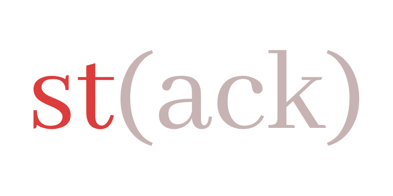
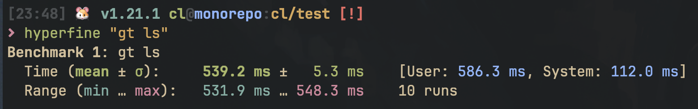

<h1 align="center">
   
</h1>

<h4 align="center">
   Yet another tool for managing stacked PRs locally and on GitHub, built on
   <a href="https://crates.io/crates/git2"><code>libgit2</code></a>
   and
   <a href="https://crates.io/crates/octocrab"><code>octocrab</code></a>.
</h4>

<p align="center">
  <a href="https://github.com/clabby/st/actions/workflows/rust_ci.yaml"></a>
  
</p>

<p align="center">
  <a href="#installation">Installation</a> •
  <a href="#what-are-stacked-prs">What are Stacked PRs?</a> •
  <a href="#usage">Usage</a> •
  <a href="#why">Why?</a> •
  <a href="#contributing">Contributing</a>
</p>

<https://github.com/user-attachments/assets/4aa0d8a3-9876-4d8b-ae23-c0337866a41b>


## Installation

> \[!WARNING\]
> `st` was written on a weekend for my own personal use, and may not be entirely stable. You're welcome to use it
> in its current state, though don't get mad at me if the tool messes up your local tree. I'll remove this warning once
> I feel that it's stable for my own usecase.

You can install `st` with:

```sh
git clone https://github.com/clabby/st && \
   cd st && \
   cargo install --bin st --path . --force
```

## What are Stacked PRs?

[stacking.dev](https://www.stacking.dev/) is a great to-the-point resource.

## Usage

```sh
st is a CLI application for working with stacked PRs locally and on GitHub.

Usage: st [OPTIONS] <COMMAND>

Commands:
  sync      Sync the remote branches with the local branches [aliases: rs, sy]
  submit    Submit the current PR stack to GitHub [aliases: s, ss]
  checkout  Checkout a branch that is tracked with `st` [aliases: co]
  create    Create and track a new branch within the current stack [aliases: c]
  delete    Delete a branch that is tracked with `st` [aliases: d, del]
  restack   Restack the the current stack [aliases: r, sr]
  log       Print a tree of all tracked stacks [aliases: l, ls]
  status    Show the status of the current stack on GitHub [aliases: st, stat]
  track     Track the current branch on top of a tracked stack node [aliases: tr]
  untrack   Untrack the passed branch [aliases: ut]
  config    Configure the st application [aliases: cfg]
  help      Print this message or the help of the given subcommand(s)

Options:
  -v...          Verbosity level (0-4)
  -h, --help     Print help
  -V, --version  Print version
```

## Why?

I'm a long-time user and lover of [Graphite](https://github.com/withgraphite). I never quite used the graphite ecosystem
as intended - only the CLI. My biggest gripe with Graphite is that they decided to disallow opting into the periphery
services that cost them money to operate, making the CLI dependent on their API and unusable in organizations without
paying $99/month (_for 5 seats_).

```text
ERROR: Your team's Graphite plan has expired. To continue using Graphite in <organization>, upgrade your
plan at https://app.graphite.dev/settings/billing?org=<organization>
```

Admittedly, this error message prompted the creation of this project. This tool aims to be dependent only on the
GitHub API, and to contain a minified version of the Graphite CLI's featureset. `st` is not a _service_, it is just a
_tool_. It's also free software - go crazy. If you enjoy using this tool, consider
[buying me a beer if we ever meet](./LICENSE.md).

> \[!NOTE\]
>
> This tool is meant for the common-{wo}man working on open source projects, not for enterprise customers.
>
> If you're looking for a more feature-rich ecosystem for stacked PRs that has a support team,
> andressen-horowitz funding, etc., I do recommend checking out Graphite. They'll actually fix your bugs promptly,
> I might not. The Graphite team is great, and they've built something very special - so much so that `st` emulates its
> featureset. I just wish I could opt-out of the fancy stuff and not pay for work that the GitHub API can do for free!
>
> If you're someone who doesn't care about features like AI code review, web interfaces, etc., and you just want
> to be able to manage PR stacks, this could be the tool for you.

### Why not [`git-branchless`](https://github.com/arxanas/git-branchless)?

Too complicated. The tool is far from focused on PR stacks, with tons of other features. Good tool, not for me. Graphite
feels good because it leads users into the [_pit of success_](https://blog.codinghorror.com/falling-into-the-pit-of-success/).
`git-branchless` is like `git`, in that it has so many features, it's highly likely its users don't even know about
all of them.

### Why not [`charcoal`](https://github.com/danerwilliams/charcoal)?

Very close to what I want, but:

1. Looks unmaintained. It's a fork of the formerly-open-source Graphite without dependencies on the propietary
   and pay-walled Graphite API, which I sung praises for above. However, it doesn't inherit some of the nice new
   features that I enjoy.
2. Doesn't have ergonomic aliases.
3. Doesn't support the comments on GitHub PRs that direct reviewers around the stack.
4. Similar to `graphite`, painfully slow. It's written in TypeScript and pings its API quite a bit, making even
   operations like `gt ls` take > 500ms. I like my CLI tools snappy!



### Why not [`spr`](https://github.com/ejoffe/spr)?

Mainly because it's restrictive. I don't like the idea of 1 commit = 1 PR - it makes the workflow feel less fluid.
Again, nice tool, just not for me.

### Why not _yet-another-stacked-pr-tool_

Because I want to control my own destiny. We can end the conversation here...


## Contributing

Contributions are welcome. Feel free to [submit an issue](https://github.com/clabby/st/issues/new) or open a PR with
your changes.
